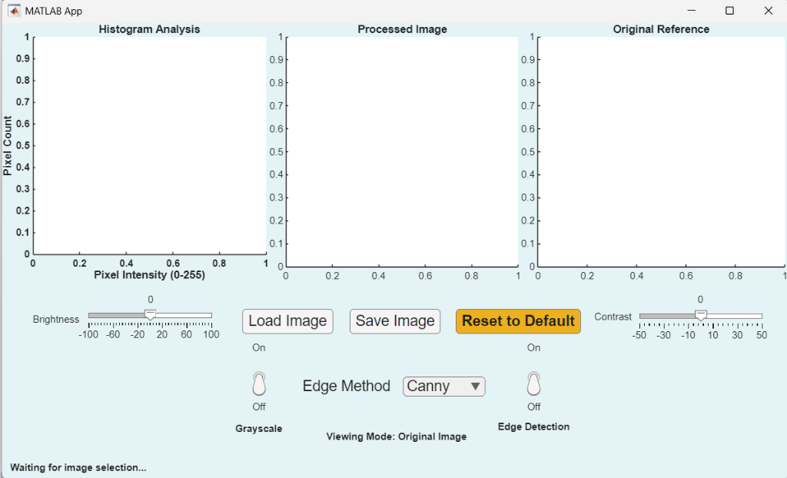
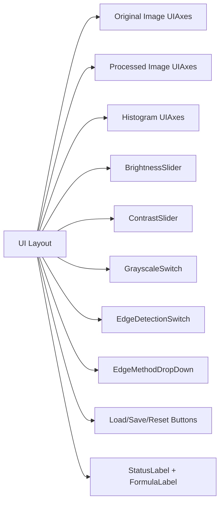

# SmartPixelProcessor




SmartPixelProcessor is a MATLAB App Designer application for interactive image processing with live histogram analysis, ITU-R BT.601 grayscale conversion, brightness and contrast control, clip-safe linear transform, and edge detection using Canny and Sobel.

## Features

- Load any RGB or grayscale image using a simple UI
- Apply ITU-R BT.601 grayscale conversion with a dedicated toggle
- Control brightness and contrast with sliders and formula feedback
- Clip transformed pixel values to the valid `[0,255]` range
- Choose Canny or Sobel edge detection in real time
- Display original and processed images side-by-side
- Render live RGB/grayscale intensity histogram on demand
- Save processed output as a standard image file

## Architecture

```mermaid
flowchart TD
    A([Load Image]) --> B{Grayscale?}
    B -- Yes --> C[Grayscale Conversion]
    B -- No --> C[Skip Conversion]
    C --> D[Linear Transform]
    D --> E[Clipping 0..255]
    E --> F{Edge Detection?}
    F -- Yes --> G[Edge Detection (Canny / Sobel)]
    F -- No --> H[Display Processed]
    G --> H
    H --> I[Update Histogram]
```



## How to Run

Recommended:

1. Open MATLAB.
2. Double-click `SmartPixelProcessor.mlapp` in the Current Folder browser.
3. Or run the app from the Command Window:

```matlab
SmartPixelProcessor
```

Alternative:

- Run directly from the class:

```matlab
app = SmartPixelProcessor;
```

## Usage


1. Click **Load** and select an image.
2. Adjust **Brightness** and **Contrast** sliders.
3. Toggle **Grayscale** and **Edge Detection**.
4. Use the **Edge Method** dropdown to choose between **Canny** and **Sobel**.
5. Save your processed image with **Save**.
6. Reset the app with **Reset** if you want to start over.

## Controls Reference

| Control | Purpose | Notes |
|---|---|---|
| Brightness Slider | Adds an offset `b` to every pixel | Range: `-100` to `100` |
| Contrast Slider | Scales pixel values by `c = 1 + contrast/50` | Range: `-50` to `50` |
| Grayscale Switch | Converts RGB to grayscale using ITU-R BT.601 weights | Uses `0.299R + 0.587G + 0.114B` |
| Edge Detection Switch | Enables edge extraction | Applies selected method after clip step |
| Edge Method Dropdown | Selects Canny or Sobel | Changes edge filter method |
| Load Button | Loads a new image | Supports PNG, JPG, TIFF, BMP |
| Save Button | Saves the processed result | Saves current processed image |
| Reset Button | Resets controls and state | Returns sliders to `0` and toggles off |
| Status Label | Displays application state | Updates after each action |
| Formula Label | Shows the active linear transform | Updates with `c` and `b` values |

## Tech Stack

- MATLAB App Designer / `matlab.apps.AppBase`
- Core MATLAB Image Processing Toolbox functions
- `edge`, `rgb2gray`, `im2uint8`, `imshow`, `histogram`
- GitHub Actions for CI

## Notes

- `SmartPixelProcessor.m` is the class-based MATLAB source implementation.
- `SmartPixelProcessor.mlapp` is the App Designer binary application file.

## Repository Contents

- `SmartPixelProcessor.m` — main App Designer application class
- `docs/` — architecture, user guide, algorithm notes
- `tests/test_SmartPixelProcessor.m` — MATLAB unit tests
- `examples/demo_script.m` — headless programmatic demo
- `.github/workflows/matlab.yml` — CI pipeline
- `CONTRIBUTING.md` — contribution guidelines
- `LICENSE` — MIT license
- `.gitignore` — MATLAB ignore patterns
