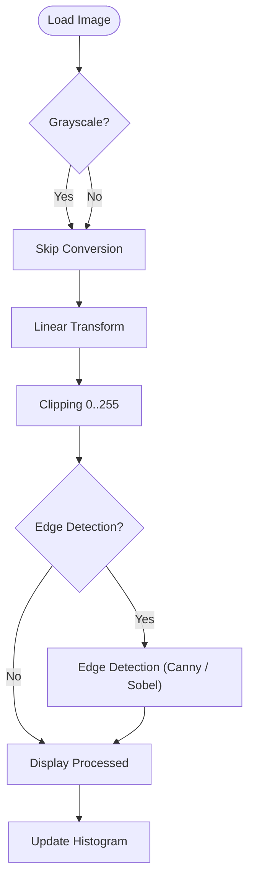
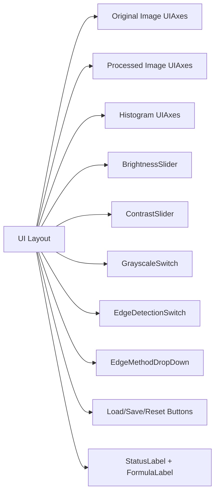

# 🎨 SmartPixelProcessor 📸


> [!NOTE]
> *הערה: כדי לראות תמונות אמיתיות של האפליקציה בגיטהאב, עליך לצלם מסך של התוכנה שלך ולשמור את התמונות בתיקייה `docs/assets/` תחת השמות `hero-screenshot.png` ו-`usage-animation.gif`, ולאחר מכן להסיר הערה זו.*

SmartPixelProcessor is a powerful MATLAB App Designer application for interactive image processing. It features live histogram analysis, ITU-R BT.601 grayscale conversion, brightness and contrast control, clip-safe linear transform, and edge detection using Canny and Sobel algorithms.

---

## ✨ Features

- **🖼️ Universal Image Loading**: Load any RGB or grayscale image using a simple UI.
- **🔳 ITU-R BT.601 Grayscale**: High-quality grayscale conversion with a dedicated toggle.
- **🔆 Brightness & Contrast**: Granular control with real-time sliders and formula feedback.
- **🔒 Clip-Safe Processing**: Automatically bounds transformed pixel values to the valid `[0,255]` range.
- **🔪 Edge Detection**: Choose between Canny or Sobel edge detection in real time.
- **🔍 Side-by-Side Comparison**: Display original and processed images concurrently for instant feedback.
- **📊 Live Histograms**: Render real-time RGB/grayscale intensity histograms on demand.
- **💾 Export**: Save your processed output as a standard high-quality image file.

---

## 🧮 Mathematical Foundations

The core image processing relies on fundamental mathematical transformations:

### 1. Grayscale Conversion (ITU-R BT.601)
$$ Y = 0.299 \cdot R + 0.587 \cdot G + 0.114 \cdot B $$

### 2. Linear Contrast and Brightness Transform
For a given pixel intensity $I$, the new intensity $I'$ is calculated as:
$$ I' = c \cdot I + b $$
Where $c$ is the contrast multiplier and $b$ is the brightness offset.

### 3. Clipping Function
To ensure valid 8-bit image data:
$$ I_{final} = \max(0, \min(255, I')) $$

---

## 🏗️ Architecture





---

## 🚀 How to Run

### Recommended Method:
1. Open MATLAB.
2. Double-click `SmartPixelProcessor.mlapp` in the Current Folder browser.
3. Or run the app directly from the Command Window:
```matlab
SmartPixelProcessor
```

### Alternative Method (Class-based):
Run directly from the instantiated class:
```matlab
app = SmartPixelProcessor;
```

---

## 🎮 Usage

1. Click **Load** and select an image from your computer.
2. Adjust the **Brightness** and **Contrast** sliders to see real-time updates.
3. Toggle **Grayscale** and **Edge Detection** to apply filters.
4. Use the **Edge Method** dropdown to seamlessly switch between **Canny** and **Sobel** algorithms.
5. Save your masterpiece using the **Save** button.
6. Hit **Reset** anytime to restore the image to its original state.

---

## 🎛️ Controls Reference

| Control | Purpose | Mathematical Effect / Range |
|---|---|---|
| 🔆 **Brightness Slider** | Adds an offset `b` to every pixel | Range: `-100` to `100` |
| 🌗 **Contrast Slider** | Scales pixel values by `c = 1 + contrast/50` | Range: `-50` to `50` |
| 🔲 **Grayscale Switch** | Converts RGB to grayscale | Uses `0.299R + 0.587G + 0.114B` |
| 🔪 **Edge Detection Switch** | Enables edge extraction | Applies post-clip edge masking |
| ⚙️ **Edge Method Dropdown** | Selects Canny or Sobel | Swaps underlying filter kernel |
| 📂 **Load Button** | Loads a new image | Supports `PNG`, `JPG`, `TIFF`, `BMP` |
| 💾 **Save Button** | Saves the processed result | Writes matrix to file |
| 🔄 **Reset Button** | Resets controls and state | `b=0`, `c=1`, all toggles off |
| ℹ️ **Status Label** | Displays application state | Event-driven text updates |
| 🔢 **Formula Label** | Shows active linear transform | Displays active `c` and `b` values |

---

## 💻 Tech Stack

- **MATLAB App Designer** / `matlab.apps.AppBase`
- **Core MATLAB Image Processing Toolbox** functions
- Built-in algorithms: `edge`, `rgb2gray`, `im2uint8`, `imshow`, `histogram`
- **GitHub Actions** for Continuous Integration (CI)

---

## 📂 Repository Contents

- `SmartPixelProcessor.m` — Main App Designer application class code
- `SmartPixelProcessor.mlapp` — App Designer binary application file
- `docs/` — Architecture diagrams, user guide, and algorithmic notes
- `tests/test_SmartPixelProcessor.m` — Comprehensive MATLAB unit tests
- `examples/demo_script.m` — Headless programmatic demonstration script
- `.github/workflows/matlab.yml` — CI pipeline configuration
- `CONTRIBUTING.md` — Guidelines for community contributions
- `LICENSE` — MIT license details
- `.gitignore` — Standard MATLAB ignore patterns
