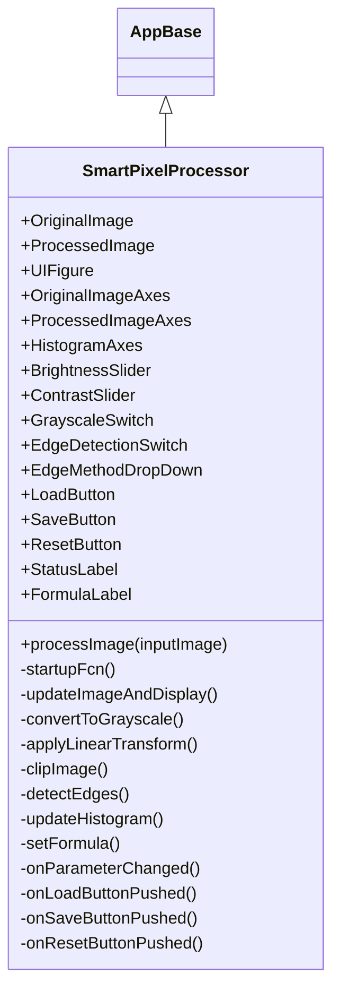
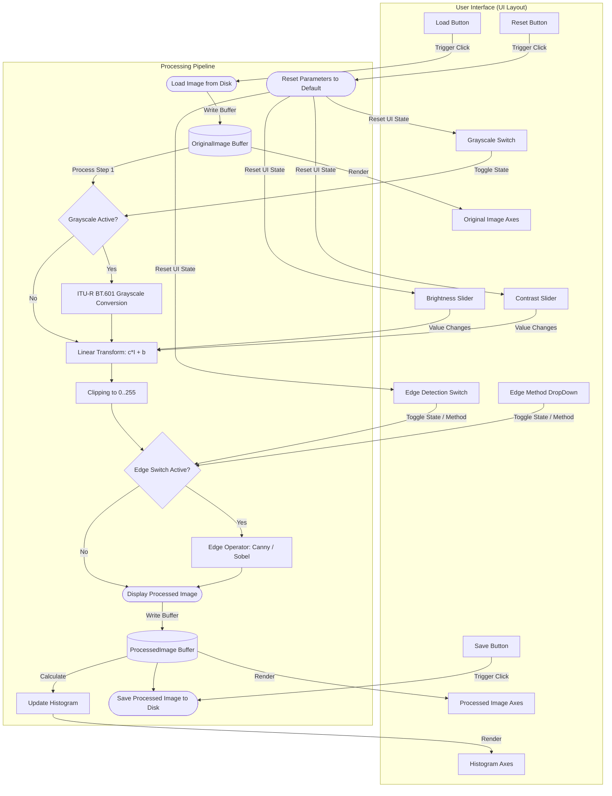

# 🎨 SmartPixelProcessor 📸


> [!NOTE]
> **הנחיות להוספת תמונות לפרויקט:**
> 1. צלם מסך של האפליקציה במחשב שלך.
> 2. שמור את תמונת המסך בנתיב: `docs/assets/hero-screenshot.png`
> 3. במידה ויש אנימציה (GIF), שמור אותה בנתיב: `docs/assets/usage-animation.gif`
> 4. לאחר מכן, תוכל למחוק את תיבת ההערה הזו מקובץ ה-`README.md`.

SmartPixelProcessor is a powerful MATLAB App Designer application for interactive image processing. It features live histogram analysis, ITU-R BT.601 grayscale conversion, brightness and contrast control, clip-safe linear transform, and edge detection using Canny and Sobel algorithms.

---

##  Table of Contents
- [ Features](#-features)
- [ How to Run](#-how-to-run)
- [ User Guide](#-user-guide)
- [ Mathematical Foundations & Algorithms](#-mathematical-foundations--algorithms)
- [ Architecture & Design](#️-architecture--design)
- [ Controls Reference](#️-controls-reference)
- [ Tech Stack](#-tech-stack)
- [ Repository Contents](#-repository-contents)

---

##  Features

- ** Universal Image Loading**: Load any RGB or grayscale image using a simple UI.
- ** ITU-R BT.601 Grayscale**: High-quality grayscale conversion with a dedicated toggle.
- ** Brightness & Contrast**: Granular control with real-time sliders and formula feedback.
- ** Clip-Safe Processing**: Automatically bounds transformed pixel values to the valid `[0,255]` range.
- ** Edge Detection**: Choose between Canny or Sobel edge detection in real time.
- ** Side-by-Side Comparison**: Display original and processed images concurrently for instant feedback.
- ** Live Histograms**: Render real-time RGB/grayscale intensity histograms on demand.
- ** Export**: Save your processed output as a standard high-quality image file.

---

## 🚀 How to Run

### Recommended Method:
1. Open MATLAB.
2. Double-click `SmartPixelProcessor.mlapp` in the Current Folder browser.
3. Or run the app directly from the Command Window:
```matlab
SmartPixelProcessor
```

### Alternative Method (Class-based):
Run directly from the instantiated class:
```matlab
app = SmartPixelProcessor;
```

---

## 🎮 User Guide

### Getting Started
1. Open MATLAB and navigate to the project directory.
2. Launch the application (see [How to Run](#-how-to-run)).
3. The app window will open displaying three main panels:
   - **Original Image** (left panel)
   - **Processed Image** (center panel)
   - **Histogram** (right panel)

### Load an Image
- Click the **Load** button.
- Select any supported image file (`PNG`, `JPG`, `TIFF`, or `BMP`).
- The original image appears in the left panel, and the processed image and histogram will update automatically.

### Adjusting Controls
- **Brightness**: Drag the slider to add an offset to each pixel. Move right to brighten, left to darken.
- **Contrast**: Drag the slider to scale the intensity range.
- **Grayscale**: Toggle the switch to convert RGB channels to grayscale.
- **Edge Detection**: Toggle on to view the extracted edges of the image as a binary map.
- **Edge Method**: Swap between **Canny** (for cleaner, noise-resistant edges) and **Sobel** (for simple gradient boundaries).

### Histogram Interpretation
- The live histogram plots pixel counts against intensity levels.
- For grayscale images, it shows the distribution of a single channel.
- For color images, it plots the distribution of the active processed output.
- **Narrow peaks** indicate low contrast (limited tonal range).
- **Wide spreads** represent high contrast.
- **Spikes at the edges** (0 or 255) indicate clipping in shadows or highlights.

### Saving Results & Resetting
- **Save**: Click **Save** to write the current processed image to disk.
- **Reset**: Click **Reset** to return all sliders to zero and disable active switches.

### Tips & Tricks
- When dealing with low-contrast images, convert to **Grayscale** and increase the **Contrast** slightly before enabling **Edge Detection** to get cleaner outlines.
- If the output is too dark, increase the **Brightness** slider first before applying **Contrast**.

---

## 🧮 Mathematical Foundations & Algorithms

The image processing engine implements the following mathematical operations:

### 1. Grayscale Conversion (ITU-R BT.601)
The app uses the ITU-R BT.601 weighted formula to convert RGB pixel values to grayscale, matching human visual perception of luminance:
$$
I_{gray} = 0.299 \cdot R + 0.587 \cdot G + 0.114 \cdot B
$$
*Note: The green channel receives the highest weighting because the human eye is most sensitive to green wavelengths.*

### 2. Linear Contrast & Brightness Transform
The linear pixel transform scales and shifts the intensity values:
$$
I_{out} = c \cdot I_{in} + b
$$
Where:
- $b$ is the brightness offset controlled by the slider (range: $[-100, 100]$).
- $c$ is the contrast multiplier computed from the slider value:
  $$
  c = 1 + \frac{\text{contrast}}{50}
  $$

### 3. Clip-Safe Intensity Boundary
To ensure that computed intensities do not overflow or underflow standard 8-bit image formats, the values are clipped:
$$
I_{clip} = \min\left(\max\left(I_{out}, 0\right), 255\right)
$$

### 4. Edge Detection & Gradient Math
- **Canny**: Applies a multi-stage process (Gaussian smoothing, Sobel gradients, non-maximum suppression, and hysteresis thresholding) to yield clean, single-pixel-wide binary edges.
- **Sobel**: Computes the approximate gradient magnitude using 3x3 convolution kernels:
  $$
  \nabla I = \sqrt{G_x^2 + G_y^2}
  $$
  Where the derivative filters $G_x$ and $G_y$ are defined as:
  $$
  G_x = \begin{bmatrix} -1 & 0 & 1 \\ -2 & 0 & 2 \\ -1 & 0 & 1 \end{bmatrix}, \quad G_y = \begin{bmatrix} -1 & -2 & -1 \\ 0 & 0 & 0 \\ 1 & 2 & 1 \end{bmatrix}
  $$

---

## 🏗️ Architecture & Design

### Class Hierarchy

### Unified Architecture & Data Pipeline


### Memory & Performance Management
- **Buffers**: The app maintains exactly two persistent image matrices in memory: `OriginalImage` and `ProcessedImage` to minimize footprint.
- **On-Demand Transforms**: All operations are executed sequentially on demand to avoid spawning large temporary arrays.
- **DataType Consistency**: The `clipImage` function casts computed doubles back to `uint8` matrices to keep data structures compact.

---

## 🎛️ Controls Reference

| Control | Purpose | Mathematical Effect / Range |
|---|---|---|
|  **Brightness Slider** | Adds an offset `b` to every pixel | Range: `-100` to `100` |
|  **Contrast Slider** | Scales pixel values by `c = 1 + contrast/50` | Range: `-50` to `50` |
|  **Grayscale Switch** | Converts RGB to grayscale | Uses `0.299R + 0.587G + 0.114B` |
|  **Edge Detection Switch** | Enables edge extraction | Applies post-clip edge masking |
|  **Edge Method Dropdown** | Selects Canny or Sobel | Swaps underlying filter kernel |
|  **Load Button** | Loads a new image | Supports `PNG`, `JPG`, `TIFF`, `BMP` |
|  **Save Button** | Saves the processed result | Writes matrix to file |
|  **Reset Button** | Resets controls and state | `b=0`, `c=1`, all toggles off |
|  **Status Label** | Displays application state | Event-driven text updates |
|  **Formula Label** | Shows active linear transform | Displays active `c` and `b` values |

---

## 💻 Tech Stack

- **MATLAB App Designer** / `matlab.apps.AppBase`
- **Core MATLAB Image Processing Toolbox** functions
- Built-in algorithms: `edge`, `rgb2gray`, `im2uint8`, `imshow`, `histogram`
- **GitHub Actions** for Continuous Integration (CI)

---

## 📂 Repository Contents

- `SmartPixelProcessor.m` — Main App Designer application class code
- `SmartPixelProcessor.mlapp` — App Designer binary application file
- `docs/` — Folder containing screenshots and assets (excluding redundant markdown files)
- `tests/test_SmartPixelProcessor.m` — Comprehensive MATLAB unit tests
- `examples/demo_script.m` — Headless programmatic demonstration script
- `.github/workflows/matlab.yml` — CI pipeline configuration
- `CONTRIBUTING.md` — Guidelines for community contributions
- `LICENSE` — MIT license details
- `.gitignore` — Standard MATLAB ignore patterns
