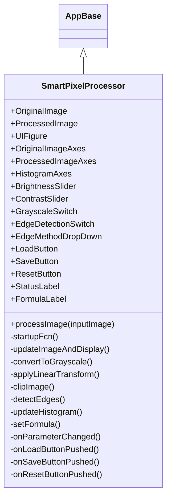
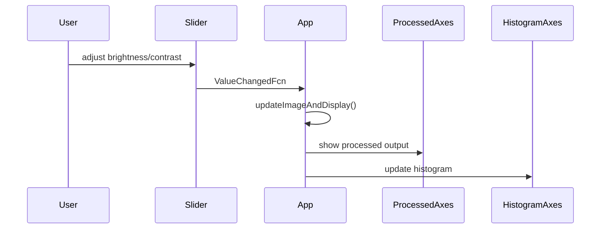
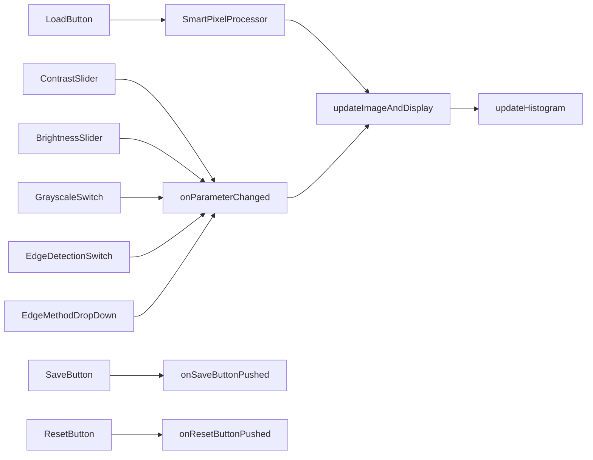

# Architecture

## Class Hierarchy



## Data Flow

```mermaid
flowchart TD
    Load[Load Image] -->|Read from disk| Original[OriginalImage]
    Original -->|Optional conversion| Gray{Grayscale toggle}
    Gray --> Transform[Linear Transform]
    Transform --> Clip[Clip to [0,255]]
    Clip --> Edge{Edge Detection toggle}
    Edge -->|Yes| EdgeOp[Edge Operator]
    EdgeOp --> Display[Display Processed Image]
    Edge -->|No| Display
    Display --> Histogram[Render Histogram]
```

## Processing Pipeline Sequence



## Math Formulas

- Grayscale conversion:

  $$I_{gray} = 0.299 R + 0.587 G + 0.114 B$$

- Linear transform:

  $$I_{out} = c \cdot I_{in} + b$$

  where:

  $$c = 1 + \frac{contrast}{50}$$

- Clipping function:

  $$I_{clip} = \min\left(\max\left(I_{out},0\right),255\right)$$

- Edge detection gradient magnitude (Sobel):

  $$\nabla I = \sqrt{\left(\frac{\partial I}{\partial x}\right)^2 + \left(\frac{\partial I}{\partial y}\right)^2}$$

## Callback Dependency Graph



## Memory Management Notes

- The application stores only two primary image buffers: `OriginalImage` and `ProcessedImage`.
- All intermediate transforms are computed on demand, minimizing long-lived temporary arrays.
- `clipImage` converts the final result back to `uint8` to keep memory consistent with standard image storage.
- Large arrays are released when the app is deleted and when new images are loaded.
- UI handles remain persistent in `UIFigure`; careful event wiring avoids anonymous function closures that capture large image data.
